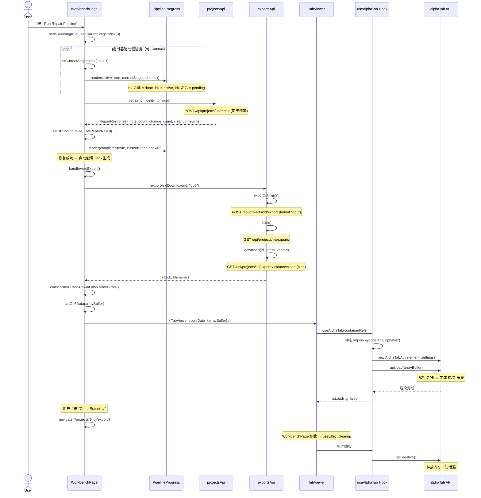
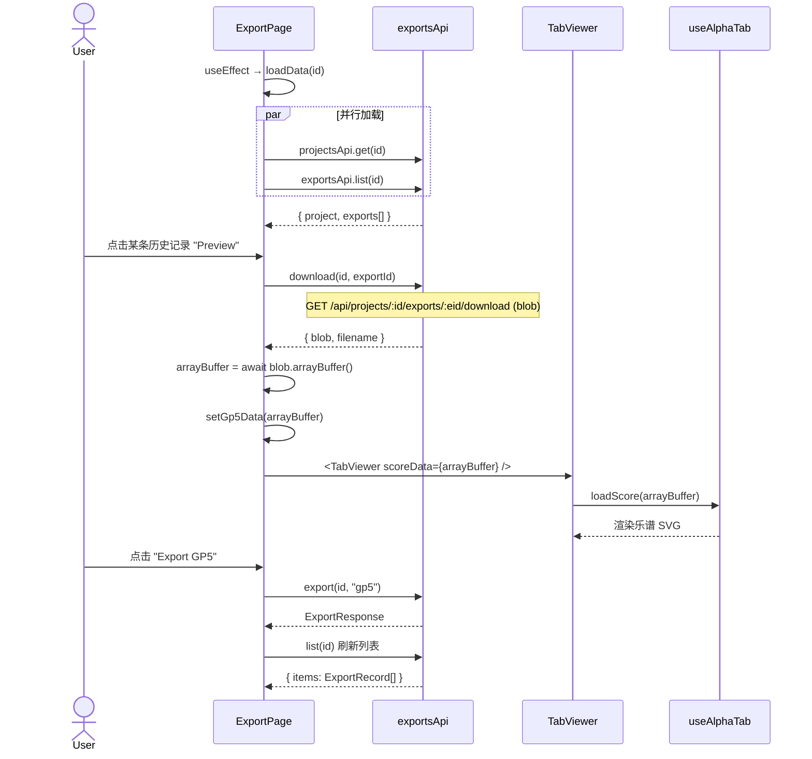
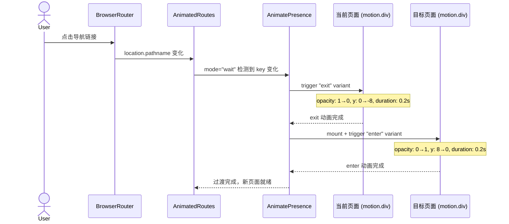
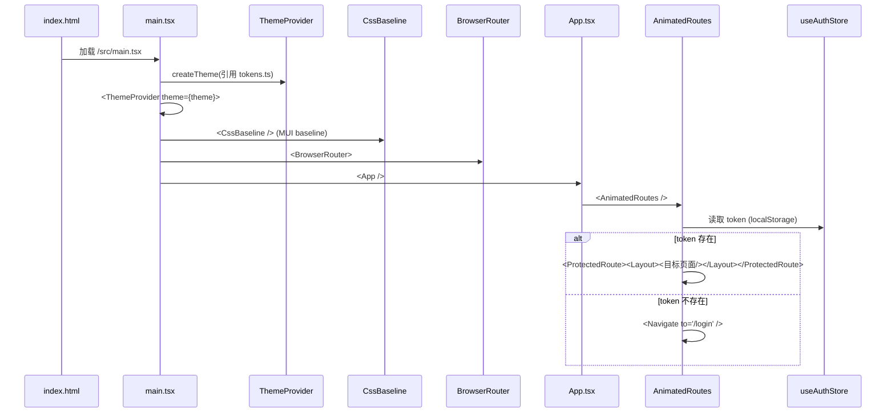
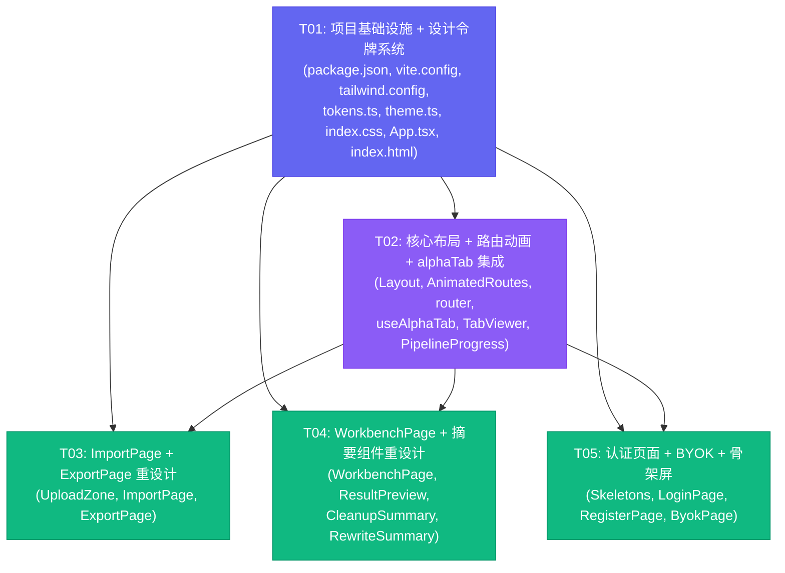

# FretPilot v2 前端重架构方案

> 架构师：高见远（Gao）  
> 日期：2026-08-15  
> 基于：产品经理许清楚的 PRD（FretPilot v2 前端重设计）

---

## 目录

- [Part A: 系统设计](#part-a-系统设计)
  - [1. 实现方案与框架选型](#1-实现方案与框架选型)
  - [2. 文件列表](#2-文件列表)
  - [3. 数据结构与接口](#3-数据结构与接口)
  - [4. 程序调用流程](#4-程序调用流程)
  - [5. 待明确事项](#5-待明确事项)
- [Part B: 任务分解](#part-b-任务分解)
  - [6. 依赖包列表](#6-依赖包列表)
  - [7. 任务列表](#7-任务列表)
  - [8. 共享知识](#8-共享知识)
  - [9. 任务依赖图](#9-任务依赖图)

---

## Part A: 系统设计

### 1. 实现方案与框架选型

#### 1.1 当前状态分析

FretPilot v2 前端是一个 React 18 + MUI 5 + Tailwind（未使用）+ Zustand + Axios + Vite 的 MVP。存在以下核心问题：

| 问题 | 现状 | 影响 |
|------|------|------|
| 视觉同质化 | MUI 默认蓝色 `#1a73e8`，零品牌识别度 | 产品缺乏专业感 |
| Tailwind 形同虚设 | 配置了 `fretpilot` 色板但全站零 utility class 使用 | 浪费工具链 |
| 零音乐可视化 | 修复结果只有文字+表格，无乐谱渲染 | 核心价值无法展示 |
| PipelineProgress bug | `idx < PIPELINE_STAGES.length` 恒为 true（idx 0-6, length=7） | 进度条假完成 |
| 假进度模拟 | WorkbenchPage 用 7×200ms setTimeout 模拟，与真实阶段无关 | 用户体验欺骗 |
| 无加载骨架屏 | 全站用 CircularProgress 转圈 | 视觉跳动严重 |
| 无页面过渡 | 路由切换生硬跳转 | 缺乏流畅感 |

#### 1.2 技术栈确认

保持现有技术栈不变，新增两个依赖：

| 技术 | 版本 | 用途 | 选型理由 |
|------|------|------|----------|
| React | ^18.2.0 | UI 框架 | 现有基础，无需迁移 |
| MUI 5 | ^5.14.0 | 复杂组件库 | Select/Slider/Table/Dialog 继续使用 |
| Tailwind CSS | ^3.4.0 | 布局/间距/颜色 utility | Notion/Linear 风格的核心工具 |
| Zustand | ^4.5.0 | 状态管理 | 现有 auth store，轻量够用 |
| Axios | ^1.6.0 | HTTP 客户端 | 现有 API 层，无需更换 |
| Vite | ^5.1.0 | 构建工具 | 现有配置，扩展即可 |
| **@coderline/alphatab** | **^1.8.0** | **吉他谱渲染** | **PRD 指定，支持 GP3-7 格式，SVG 渲染** |
| **framer-motion** | **^11.0.0** | **动画/过渡** | **React 生态最成熟的动画库，AnimatePresence 支持路由过渡** |
| **vite-plugin-static-copy** | **^1.0.0** | **alphaTab 字体资源拷贝** | **将 Bravura 乐谱字体自动复制到构建产物** |

#### 1.3 架构模式

采用 **分层组件架构**（Layered Component Architecture），在现有 MVP 基础上演进：

```
┌─────────────────────────────────────────────────┐
│                  App Shell (main.tsx)            │
│  ThemeProvider + CssBaseline + BrowserRouter     │
├─────────────────────────────────────────────────┤
│              AnimatedRoutes (router.tsx)          │
│  AnimatePresence + ProtectedRoute                │
├─────────────────────────────────────────────────┤
│  Layout (顶部导航栏 h:56px + 响应式)              │
├──────────────┬──────────────────────────────────┤
│   Pages      │           Components              │
│  (6 pages)   │  Layout / TabViewer / Pipeline    │
│              │  UploadZone / Summaries / Skeleton│
├──────────────┼──────────────────────────────────┤
│   Hooks      │           Styles / Tokens         │
│  useAlphaTab │  tokens.ts (单一真相源)            │
├──────────────┴──────────────────────────────────┤
│           API Layer (client.ts + types.ts)       │
│           Store Layer (auth.ts)                  │
└─────────────────────────────────────────────────┘
```

#### 1.4 设计令牌系统（核心创新）

**单一真相源**：所有颜色令牌定义在 `src/styles/tokens.ts`，同时被 Tailwind config 和 MUI theme 引用，确保两者完全一致。

```
tokens.ts (定义)
    ├── tailwind.config.ts (引用 → 生成 bg-canvas, text-primary 等 utility)
    └── theme.ts (引用 → MUI palette.primary.main 等)
```

这样避免了"Tailwind 改了色但 MUI 没同步"或反之的问题。

#### 1.5 Tailwind + MUI 混用规则

| 场景 | 使用工具 | 示例 |
|------|----------|------|
| 布局/间距/Flex | Tailwind | `className="flex gap-4 p-6"` |
| 颜色/背景/边框 | Tailwind | `className="bg-surface text-secondary border border-default"` |
| Select / Slider / Table / Dialog | MUI | `<Select>`, `<Slider>`, `<TableContainer>` |
| 按钮（简单） | Tailwind + 原生 button | `<button className="btn-primary">` |
| 按钮（含图标/loading） | MUI Button | `<Button startIcon={...}>` |
| 表单输入 | MUI TextField | `<TextField>` (保持一致性) |
| 动画 | Framer Motion | `<motion.div>` |

**规则**：`preflight: false` 保持不变，避免覆盖 MUI baseline。

#### 1.6 alphaTab 集成策略

**数据流**（PRD 确认，不新增后端端点）：

```
修复完成 → POST /export (gp5) → GET /exports (取最新) → GET /download (blob)
    → blob.arrayBuffer() → alphaTab api.load(arrayBuffer) → SVG 渲染
```

**组件设计**：
- `<TabViewer scoreData={ArrayBuffer | null} />` — 可复用组件，WorkbenchPage 和 ExportPage 共用
- `useAlphaTab(containerRef)` — 自定义 Hook，管理 alphaTab API 生命周期
- 组件卸载时 `api.destroy()` 防内存泄漏
- 动态 `import('@coderline/alphatab')` 实现懒加载，不膨胀主 bundle

**资源处理**：
- alphaTab 需要 Bravura 乐谱字体（SVG 渲染依赖）
- 使用 `vite-plugin-static-copy` 将 `node_modules/@coderline/alphatab/dist/font/*` 拷贝到 `/font/`
- alphaTab settings: `{ core: { fontDirectory: '/font/' }, player: { enable: false } }`
- 暂不启用音频播放（PRD 未要求），仅渲染乐谱

#### 1.7 PipelineProgress Bug 修复方案

**当前 bug**（`PipelineProgress.tsx` 第35行）：
```typescript
// idx 范围 0-6, PIPELINE_STAGES.length = 7
// idx < 7 恒为 true → active 时所有 stage 都显示为 done
const isDone = completed || (active && idx < PIPELINE_STAGES.length);
```

**修复方案**：引入 `currentStageIndex` prop，WorkbenchPage 用定时器驱动阶段推进：

```typescript
interface PipelineProgressProps {
  active: boolean;
  completed: boolean;
  currentStageIndex: number;  // 新增：当前执行到的阶段索引
}

// 修复后的判定逻辑
const isDone = completed || idx < currentStageIndex;
const isActive = active && !completed && idx === currentStageIndex;
const isPending = !isDone && !isActive;
```

**WorkbenchPage 配合修改**：移除 7×200ms 的无意义 setTimeout 循环，改为定时器驱动 `currentStageIndex` 递增（但不触及最后一阶段），API 返回后直接设为 completed。

---

### 2. 文件列表

所有文件相对于 `frontend/` 目录。标注 `[新建]` 或 `[修改]`。

#### 2.1 配置与基础设施

| 文件路径 | 操作 | 说明 |
|----------|------|------|
| `package.json` | [修改] | 新增 @coderline/alphatab, framer-motion, vite-plugin-static-copy |
| `vite.config.ts` | [修改] | 集成 viteStaticCopy 拷贝 alphaTab 字体资源 |
| `tailwind.config.ts` | [修改] | 替换为 PRD 设计令牌系统（背景4层/文字3层/品牌2色/语义4色/边框3态） |
| `index.html` | [修改] | 添加 Inter 字体 CDN 预连接 |
| `src/index.css` | [修改] | 全局样式增强：自定义滚动条、selection、focus-visible 等 |
| `src/main.tsx` | [修改] | 保持现有结构（ThemeProvider + BrowserRouter），无需大改 |
| `src/App.tsx` | [修改] | 替换为 AnimatedRoutes，集成 AnimatePresence |

#### 2.2 设计令牌系统

| 文件路径 | 操作 | 说明 |
|----------|------|------|
| `src/styles/tokens.ts` | [新建] | 设计令牌单一真相源（light + dark 预留） |
| `src/theme.ts` | [修改] | MUI theme 引用 tokens.ts，替换硬编码蓝色 |

#### 2.3 核心组件

| 文件路径 | 操作 | 说明 |
|----------|------|------|
| `src/components/Layout.tsx` | [修改] | 重设计导航栏：白底+h56px+底部1px分隔线+active指示条+响应式汉堡菜单 |
| `src/components/AnimatedRoutes.tsx` | [新建] | Framer Motion AnimatePresence 路由过渡封装 |
| `src/components/TabViewer.tsx` | [新建] | alphaTab 可复用乐谱渲染组件 |
| `src/components/PipelineProgress.tsx` | [修改] | 修复 bug + 重设计为步骤指示器 |
| `src/components/UploadZone.tsx` | [修改] | 重设计为大型拖拽区，品牌色高亮 |
| `src/components/ResultPreview.tsx` | [修改] | 重设计变更表格，stagger 动画 |
| `src/components/CleanupSummary.tsx` | [修改] | 重设计为信息卡片网格 |
| `src/components/RewriteSummary.tsx` | [修改] | 重设计为信息卡片网格 |
| `src/components/Skeletons.tsx` | [新建] | 可复用骨架屏组件（替代 CircularProgress） |

#### 2.4 Hooks

| 文件路径 | 操作 | 说明 |
|----------|------|------|
| `src/hooks/useAlphaTab.ts` | [新建] | alphaTab API 生命周期管理 Hook |

#### 2.5 页面

| 文件路径 | 操作 | 说明 |
|----------|------|------|
| `src/pages/LoginPage.tsx` | [修改] | 极简居中表单重设计 |
| `src/pages/RegisterPage.tsx` | [修改] | 极简居中表单重设计 |
| `src/pages/ImportPage.tsx` | [修改] | 大型拖拽区 + 项目列表卡片重设计 |
| `src/pages/WorkbenchPage.tsx` | [修改] | 左右分栏 + alphaTab 自动渲染 + 假进度修复 |
| `src/pages/ExportPage.tsx` | [修改] | 导出格式卡片 + 历史列表 + alphaTab 预览 |
| `src/pages/ByokPage.tsx` | [修改] | 配置表单 + 状态指示器重设计 |

#### 2.6 路由

| 文件路径 | 操作 | 说明 |
|----------|------|------|
| `src/router.tsx` | [修改] | 集成 AnimatedRoutes，保持 ProtectedRoute 逻辑 |

#### 2.7 API / Store（微调）

| 文件路径 | 操作 | 说明 |
|----------|------|------|
| `src/api/client.ts` | [修改] | 新增 `exportsApi.exportAndDownload()` 便捷方法 |
| `src/api/types.ts` | [不变] | 现有类型已覆盖需求 |
| `src/store/auth.ts` | [不变] | 现有 auth store 无需修改 |

---

### 3. 数据结构与接口

#### 3.1 类图

```mermaid
classDiagram
  %% ─── 设计令牌系统 ───
  class DesignTokens {
    +light: TokenPalette
    +dark: TokenPalette
  }

  class TokenPalette {
    +background: BackgroundTokens
    +text: TextTokens
    +brand: BrandTokens
    +semantic: SemanticTokens
    +border: BorderTokens
  }

  class BackgroundTokens {
    +canvas: string = "#FFFFFF"
    +surface: string = "#F9FAFB"
    +elevated: string = "#FFFFFF"
    +subtle: string = "#F3F4F6"
  }

  class TextTokens {
    +primary: string = "#111827"
    +secondary: string = "#6B7280"
    +tertiary: string = "#9CA3AF"
  }

  class BrandTokens {
    +primary: string = "#6366F1"
    +hover: string = "#4F46E5"
    +accent: string = "#8B5CF6"
  }

  class SemanticTokens {
    +success: string = "#10B981"
    +warning: string = "#F59E0B"
    +error: string = "#EF4444"
    +info: string = "#3B82F6"
  }

  class BorderTokens {
    +default: string = "#E5E7EB"
    +hover: string = "#D1D5DB"
    +active: string = "#6366F1"
  }

  DesignTokens --> TokenPalette
  TokenPalette --> BackgroundTokens
  TokenPalette --> TextTokens
  TokenPalette --> BrandTokens
  TokenPalette --> SemanticTokens
  TokenPalette --> BorderTokens

  %% ─── alphaTab 集成 ───
  class AlphaTabSettings {
    +core: CoreSettings
    +player: PlayerSettings
  }

  class CoreSettings {
    +fontDirectory: string = "/font/"
    +engine: string = "svg"
    +useWorkers: boolean = false
  }

  class PlayerSettings {
    +enable: boolean = false
    +soundFont: string = "/soundfont/sonivox.sf2"
  }

  class useAlphaTab {
    -containerRef: Ref~HTMLDivElement~
    -apiRef: AlphaTabApi | null
    +api: AlphaTabApi | null
    +isLoading: boolean
    +error: string | null
    +loadScore(data: ArrayBuffer): Promise~void~
    +destroy(): void
  }

  class TabViewer {
    -containerRef: Ref~HTMLDivElement~
    -hook: useAlphaTab
    +scoreData: ArrayBuffer | null
    +className: string
    +onError: (error: string) => void
    +onLoaded: () => void
  }

  useAlphaTab --> AlphaTabSettings : 配置
  TabViewer --> useAlphaTab : 组合使用

  %% ─── PipelineProgress（修复后）───
  class PipelineProgress {
    +active: boolean
    +completed: boolean
    +currentStageIndex: number
    -renderStage(stage, idx): JSX.Element
  }

  class PipelineStage {
    +name: string
    +label: string
    +status: "done" | "active" | "pending"
  }

  PipelineProgress --> PipelineStage : 渲染7个阶段

  %% ─── API 扩展 ───
  class ExportsApi {
    +export(id, format): Promise~ExportResponse~
    +list(id): Promise~{items: ExportRecord[]}~
    +download(id, exportId, fallback): Promise~{blob, filename}~
    +exportAndDownload(id, format): Promise~{blob, filename}~
  }

  ExportsApi ..> ExportResponse : 返回
  ExportsApi ..> ExportRecord : 返回

  %% ─── 页面组件关系 ───
  class WorkbenchPage {
    -project: ProjectDetail
    -fidelity: number
    -tuningId: string
    -isRunning: boolean
    -currentStageIndex: number
    -gp5Data: ArrayBuffer | null
    -repairResult: RepairResultState
    +handleRepair(): Promise~void~
    +handleAutoExport(): Promise~void~
  }

  class ExportPage {
    -project: ProjectDetail
    -exports: ExportRecord[]
    -gp5Data: ArrayBuffer | null
    +handleExport(format): Promise~void~
    +handlePreview(exp): Promise~void~
  }

  class ImportPage {
    -projects: ProjectItem[]
    -uploading: boolean
    +handleFileSelected(file): Promise~void~
  }

  WorkbenchPage --> TabViewer : 渲染乐谱
  WorkbenchPage --> PipelineProgress : 显示进度
  ExportPage --> TabViewer : 预览乐谱
  ImportPage --> UploadZone : 上传文件
  WorkbenchPage ..> ExportsApi : 自动导出GP5
  ExportPage ..> ExportsApi : 导出+预览
```

#### 3.2 关键 TypeScript 类型定义

以下为需要新增的类型定义（追加到相关文件中）：

**`src/styles/tokens.ts`**：
```typescript
/** 背景色令牌（4层） */
export interface BackgroundTokens {
  canvas: string;    // #FFFFFF — 页面底色
  surface: string;   // #F9FAFB — 卡片/面板底色
  elevated: string;  // #FFFFFF — 弹出层/模态框底色
  subtle: string;    // #F3F4F6 — 悬浮/hover 底色
}

/** 文字色令牌（3层） */
export interface TextTokens {
  primary: string;   // #111827 — 主文字
  secondary: string; // #6B7280 — 次要文字
  tertiary: string;  // #9CA3AF — 辅助/占位文字
}

/** 品牌色令牌（2色） */
export interface BrandTokens {
  primary: string;   // #6366F1 — 品牌主色（indigo-500）
  hover: string;     // #4F46E5 — 品牌悬停色（indigo-600）
  accent: string;    // #8B5CF6 — 强调色（violet-500）
}

/** 语义色令牌（4色） */
export interface SemanticTokens {
  success: string;   // #10B981
  warning: string;   // #F59E0B
  error: string;     // #EF4444
  info: string;      // #3B82F6
}

/** 边框色令牌（3态） */
export interface BorderTokens {
  default: string;   // #E5E7EB
  hover: string;     // #D1D5DB
  active: string;    // #6366F1
}

/** 完整调色板 */
export interface TokenPalette {
  background: BackgroundTokens;
  text: TextTokens;
  brand: BrandTokens;
  semantic: SemanticTokens;
  border: BorderTokens;
}

/** 设计令牌（含 light/dark 预留） */
export interface DesignTokens {
  light: TokenPalette;
  dark: TokenPalette;  // P1: 暗色模式预留，本期不启用
}

/** 导出 light 令牌（唯一真相源） */
export const lightTokens: TokenPalette = { /* ... */ };

/** 导出 dark 令牌（预留） */
export const darkTokens: TokenPalette = { /* ... */ };
```

**`src/hooks/useAlphaTab.ts`**：
```typescript
import type { AlphaTabApi } from '@coderline/alphatab';

/** alphaTab 渲染设置 */
export interface AlphaTabSettings {
  core: {
    fontDirectory: string;  // "/font/"
    engine: 'svg' | 'html5';
    useWorkers: boolean;
  };
  player: {
    enable: boolean;        // false — 本期不启用音频
    soundFont: string;
  };
}

/** useAlphaTab Hook 返回值 */
export interface UseAlphaTabReturn {
  api: AlphaTabApi | null;
  isLoading: boolean;
  error: string | null;
  loadScore: (data: ArrayBuffer) => Promise<void>;
}

/** 默认 alphaTab 设置 */
export const DEFAULT_ALPHATAB_SETTINGS: AlphaTabSettings = {
  core: { fontDirectory: '/font/', engine: 'svg', useWorkers: false },
  player: { enable: false, soundFont: '/soundfont/sonivox.sf2' },
};
```

**`src/components/TabViewer.tsx`**：
```typescript
/** TabViewer 组件 Props */
export interface TabViewerProps {
  /** GP5 文件的 ArrayBuffer，为 null 时显示占位 */
  scoreData: ArrayBuffer | null;
  /** 额外 CSS 类名 */
  className?: string;
  /** 渲染出错时的回调 */
  onError?: (error: string) => void;
  /** 乐谱加载完成时的回调 */
  onLoaded?: () => void;
}
```

**`src/components/PipelineProgress.tsx`**（修复后）：
```typescript
/** 单个管道阶段 */
export interface PipelineStage {
  name: string;
  label: string;
}

/** 阶段状态 */
export type StageStatus = 'done' | 'active' | 'pending';

/** PipelineProgress Props（修复后） */
export interface PipelineProgressProps {
  /** 是否正在运行 */
  active: boolean;
  /** 是否已完成 */
  completed: boolean;
  /** 当前执行到的阶段索引（0-6），修复 bug 的核心新增字段 */
  currentStageIndex: number;
}
```

**`src/components/Skeletons.tsx`**：
```typescript
/** 项目列表骨架屏 */
export function ProjectListSkeleton(): JSX.Element;

/** 工作台骨架屏 */
export function WorkbenchSkeleton(): JSX.Element;

/** 导出页骨架屏 */
export function ExportSkeleton(): JSX.Element;

/** 通用卡片骨架 */
export function CardSkeleton(lines?: number): JSX.Element;
```

**`src/api/client.ts`**（新增方法）：
```typescript
// ExportsApi 新增便捷方法
export const exportsApi = {
  // ... 现有方法不变 ...

  /**
   * 一键导出并下载（链式调用）：
   * 1. POST /export 创建导出
   * 2. GET /exports 获取最新导出记录
   * 3. GET /download 下载文件 blob
   * 用于修复完成后自动生成 GP5 并渲染到 alphaTab。
   */
  async exportAndDownload(
    id: number,
    format: string,
  ): Promise<{ blob: Blob; filename: string }>;
};
```

**`src/components/AnimatedRoutes.tsx`**：
```typescript
/** 页面过渡动画变体 */
export const pageVariants = {
  initial: { opacity: 0, y: 8 };
  enter: { opacity: 1, y: 0 };
  exit: { opacity: 0, y: -8 };
};

/** AnimatePresence 包裹的路由组件 */
export function AnimatedRoutes(): JSX.Element;
```

---

### 4. 程序调用流程

#### 4.1 修复 → 自动 GP5 导出 → alphaTab 渲染（核心流程）



#### 4.2 ExportPage 导出 + alphaTab 预览流程



#### 4.3 页面路由过渡动画流程



#### 4.4 初始化流程（App 启动）



---

### 5. 待明确事项

#### 5.1 已做的假设

| # | 假设 | 理由 |
|---|------|------|
| 1 | alphaTab 仅用于渲染乐谱（SVG），不启用音频播放 | PRD 未提及播放需求，`player.enable = false` 可减少资源加载 |
| 2 | alphaTab 字体通过 `vite-plugin-static-copy` 拷贝到 `/font/` | 最简洁的 Vite 集成方式，dev 和 build 均可用 |
| 3 | alphaTab 通过动态 `import()` 懒加载 | 包体积较大（~500KB+），懒加载避免拖慢首屏 |
| 4 | `exportAndDownload` 链式调用中用 `list()` 取最新记录 | 后端 `POST /export` 返回的 `ExportResponse` 不含 `exportId`，需通过 `list()` 获取 |
| 5 | 假进度定时器间隔 ~400ms，且不触及最后阶段 | API 是同步阻塞的，无法获取真实进度；定时器仅用于视觉反馈，API 返回后立即置为 completed |
| 6 | 暗色模式令牌已定义但本期不启用切换 | P1 要求"预留"，tokens.ts 中定义 `darkTokens` 但不实现 toggle UI |
| 7 | 按钮策略：简单按钮用 Tailwind + 原生 button，复杂按钮（含图标/loading）用 MUI Button | 平衡灵活性与一致性 |
| 8 | `currentStageIndex` 最大设为 5（倒数第二阶段），API 返回后跳到 6（完成） | 避免假进度"假完成"的观感问题 |

#### 5.2 需要确认的问题

| # | 问题 | 影响范围 | 建议 |
|---|------|----------|------|
| 1 | 后端 `POST /export` 是否能返回 `export_id`？ | `exportAndDownload` 便捷方法的实现 | 当前通过 `list()` 取最新记录作为 workaround，若后端可返回 ID 则更可靠 |
| 2 | alphaTab 渲染 GP5 时是否需要显示多轨道选择？ | TabViewer 组件复杂度 | 建议初期只渲染第一个 guitar track，后续按需扩展 |
| 3 | `Content-Disposition` header 是否在 CORS `expose-headers` 中？ | 下载文件名解析 | 现有代码已有 fallback 逻辑，无需改动 |
| 4 | 是否需要为 alphaTab 渲染区域添加加载骨架？ | TabViewer 组件 | 建议 TabViewer 内部显示 Skeleton 占位，加载完成后淡入 SVG |

---

## Part B: 任务分解

### 6. 依赖包列表

**新增依赖（dependencies）**：
```
@coderline/alphatab@^1.8.0: 吉他谱/六线谱 SVG 渲染库，支持 GP3-7 格式
framer-motion@^11.0.0: React 动画库，提供 AnimatePresence 路由过渡 + stagger/微交互
```

**新增依赖（devDependencies）**：
```
vite-plugin-static-copy@^1.0.0: Vite 插件，将 alphaTab Bravura 字体自动拷贝到构建产物 /font/ 目录
```

**现有依赖（保持不变）**：
```
react@^18.2.0: UI 框架
react-dom@^18.2.0: React DOM 渲染
react-router-dom@^6.22.0: 路由
@mui/material@^5.14.0: MUI 组件库（Select/Slider/Table/Dialog/TextField 等）
@mui/icons-material@^5.14.0: MUI 图标
@emotion/react@^11.11.0: MUI emotion 运行时
@emotion/styled@^11.11.0: MUI styled 工具
axios@^1.6.0: HTTP 客户端
zustand@^4.5.0: 状态管理
typescript@^5.3.0: TypeScript 编译器
vite@^5.1.0: 构建工具
tailwindcss@^3.4.0: Utility CSS 框架
postcss@^8.4.0: CSS 后处理器
autoprefixer@^10.4.0: CSS 自动前缀
@vitejs/plugin-react@^4.2.0: Vite React 插件
@types/react@^18.2.0: React 类型定义
@types/react-dom@^18.2.0: React DOM 类型定义
```

---

### 7. 任务列表

> 按依赖顺序排列，共 5 个任务。每个任务至少 3 个文件。

---

#### T01: 项目基础设施 + 设计令牌系统

**优先级**：P0  
**依赖**：无  
**文件**：
- `package.json` [修改] — 新增 3 个依赖
- `vite.config.ts` [修改] — 集成 viteStaticCopy 拷贝 alphaTab 字体
- `tailwind.config.ts` [修改] — 替换为 PRD 设计令牌系统
- `index.html` [修改] — 添加 Inter 字体预连接
- `src/styles/tokens.ts` [新建] — 设计令牌单一真相源（light + dark 预留）
- `src/theme.ts` [修改] — MUI theme 引用 tokens.ts，替换硬编码 `#1a73e8`
- `src/index.css` [修改] — 全局样式增强（自定义滚动条、selection、focus ring）
- `src/App.tsx` [修改] — 替换为 AnimatedRoutes 引用

**说明**：  
这是所有后续任务的基础。完成设计令牌系统后，Tailwind utility class（如 `bg-canvas`、`text-secondary`、`border-default`）和 MUI theme（`palette.primary.main`）将引用同一份令牌定义，确保视觉一致性。vite-plugin-static-copy 配置将 alphaTab 的 Bravura 乐谱字体自动拷贝到 `/font/` 路径。

**验收标准**：
- `npm install` 成功安装所有新依赖
- `npm run dev` 启动无报错
- Tailwind utility class `bg-brand-primary`、`text-text-primary` 等可用
- MUI 组件默认色变为 `#6366F1` 而非 `#1a73e8`
- `/font/` 路径可访问 Bravura 字体文件

---

#### T02: 核心布局 + 路由动画 + alphaTab 集成基础

**优先级**：P0  
**依赖**：T01  
**文件**：
- `src/components/Layout.tsx` [修改] — 重设计导航栏（白底 h:56px + 底部 1px 分隔线 + active 链接 2px 品牌色指示条 + <768px 汉堡菜单）
- `src/components/AnimatedRoutes.tsx` [新建] — Framer Motion AnimatePresence 路由过渡（mode="wait", opacity+y 变体, 0.2s）
- `src/router.tsx` [修改] — 集成 AnimatedRoutes，保持 ProtectedRoute 逻辑不变
- `src/hooks/useAlphaTab.ts` [新建] — alphaTab API 生命周期 Hook（动态 import + load + destroy）
- `src/components/TabViewer.tsx` [新建] — alphaTab 可复用乐谱渲染组件（scoreData prop 驱动）
- `src/components/PipelineProgress.tsx` [修改] — 修复 `idx < length` bug + 引入 `currentStageIndex` + 视觉重设计

**说明**：  
这一组任务构建所有页面共用的基础设施。Layout 重设计实现 Notion/Linear 风格的顶部导航栏。AnimatedRoutes 用 Framer Motion 的 AnimatePresence 实现路由切换的淡入淡出过渡。TabViewer + useAlphaTab 实现 alphaTab 的封装——组件接受 `scoreData: ArrayBuffer | null` prop，为 null 时显示占位骨架，非 null 时动态加载 alphaTab 并渲染乐谱。PipelineProgress 修复核心 bug：将 `idx < PIPELINE_STAGES.length`（恒 true）改为基于 `currentStageIndex` 的三态判定（done/active/pending）。

**验收标准**：
- 导航栏白底 + 底部 1px 分隔线，active 链接下方有 2px `#6366F1` 指示条
- <768px 时导航项折叠为汉堡菜单
- 路由切换有 0.2s 淡入淡出过渡
- TabViewer 传入 ArrayBuffer 后渲染出 SVG 乐谱
- TabViewer 卸载时调用 `api.destroy()`（无内存泄漏）
- PipelineProgress 运行时只有 `currentStageIndex` 之前的阶段显示为 done

---

#### T03: ImportPage + ExportPage 重设计

**优先级**：P0  
**依赖**：T01, T02  
**文件**：
- `src/components/UploadZone.tsx` [修改] — 重设计为大型拖拽区（虚线边框 + 品牌色高亮 + 拖拽时背景色变化 + 微交互反馈）
- `src/pages/ImportPage.tsx` [修改] — 大型拖拽区 + 项目列表卡片网格（替换 List 为 Card 网格 + 状态 Chip + hover 微交互 + 骨架屏）
- `src/pages/ExportPage.tsx` [修改] — 导出格式卡片 + 历史列表 + alphaTab 预览（点击历史记录可预览 GP5 乐谱）

**说明**：  
ImportPage 重设计：UploadZone 改为视觉突出的大型拖拽区，项目列表从 MUI List 改为卡片网格布局，每个卡片显示标题、状态、风格标签，hover 时有品牌色边框微交互，加载时显示骨架屏替代 CircularProgress。ExportPage 重设计：两个导出格式（GP5 / Ample MIDI）显示为可点击卡片，历史列表中每条记录增加"Preview"按钮，点击后调用 `exportsApi.download()` 获取 blob → ArrayBuffer，传入 TabViewer 渲染乐谱预览。

**验收标准**：
- UploadZone 拖拽时边框和背景变为品牌色
- 项目列表为卡片网格，hover 有微交互
- 加载状态显示骨架屏而非转圈
- ExportPage 历史记录可点击 Preview 渲染 alphaTab 乐谱
- 导出按钮 loading 时有骨架/禁用态

---

#### T04: WorkbenchPage + 摘要组件重设计

**优先级**：P0  
**依赖**：T01, T02  
**文件**：
- `src/pages/WorkbenchPage.tsx` [修改] — 左右分栏（左 320px 参数面板 / 右 flex-1 结果区含 alphaTab）+ 假进度定时器修复 + 修复完成自动 GP5 渲染 + 响应式（<1024px 上下堆叠）
- `src/components/ResultPreview.tsx` [修改] — 重设计变更表格（更清晰的 Before→After 对比 + 置信度色阶 + stagger 出场动画）
- `src/components/CleanupSummary.tsx` [修改] — 重设计为信息卡片网格（图标 + 数值 + 标签）
- `src/components/RewriteSummary.tsx` [修改] — 重设计为信息卡片网格 + 状态指示器

**说明**：  
WorkbenchPage 核心改造：布局从单列改为左右分栏——左侧 320px 固定宽度面板包含修复参数（fidelity slider、tuning select、run 按钮），右侧 flex-1 区域依次显示 PipelineProgress、CleanupSummary、RewriteSummary、ResultPreview 和 TabViewer。移除原有的 7×200ms setTimeout 循环，改为定时器驱动 `currentStageIndex` 递增（间隔 ~400ms，最大到 5），API 返回后立即置为 completed。修复成功后自动调用 `exportsApi.exportAndDownload(id, "gp5")` 获取 GP5 blob → ArrayBuffer，传入 TabViewer 渲染乐谱。三个摘要组件从 Chip 堆叠重设计为结构化信息卡片网格，ResultPreview 的变更表格增加 stagger 出场动画。

**验收标准**：
- 左右分栏布局，左侧 320px 固定，右侧自适应
- <1024px 时左右栏上下堆叠
- PipelineProgress 阶段逐步推进，不再一次性全亮
- 修复完成后右侧自动渲染 alphaTab 乐谱
- 摘要组件为卡片网格布局，ResultPreview 有 stagger 动画

---

#### T05: 认证页面 + BYOK 页面 + 骨架屏组件

**优先级**：P0（页面重设计）+ P1（骨架屏）  
**依赖**：T01, T02  
**文件**：
- `src/components/Skeletons.tsx` [新建] — 可复用骨架屏组件（ProjectListSkeleton / WorkbenchSkeleton / ExportSkeleton / CardSkeleton）
- `src/pages/LoginPage.tsx` [修改] — 极简居中表单（品牌色 logo + 表单卡片 + 微交互 + 错误状态视觉优化）
- `src/pages/RegisterPage.tsx` [修改] — 极简居中表单（与 LoginPage 一致风格 + 密码确认）
- `src/pages/ByokPage.tsx` [修改] — 配置表单 + 状态指示器（已配置/未配置状态卡片 + 表单 + 测试连接反馈）

**说明**：  
LoginPage / RegisterPage 重设计为 Notion/Linear 风格的极简居中表单——白色卡片浮于 surface 背景上，品牌色 logo，输入框聚焦时有品牌色 ring，提交按钮品牌色填充 + hover 加深 + press 缩放微交互，错误状态用语义色 error 边框 + 文字提示。ByokPage 重设计：顶部显示配置状态指示器（已配置 → 绿色 success 卡片显示 masked key / 未配置 → info 提示卡片），下方为配置表单，Test Connection 按钮有 loading 态和结果反馈。Skeletons.tsx 提供可复用的骨架屏组件，替代全站的 CircularProgress——骨架屏使用 surface/subtle 色阶的脉冲动画，视觉上更接近最终内容布局。

**验收标准**：
- 登录/注册表单居中，品牌色主题
- 输入框 focus 有品牌色 ring
- 提交按钮有 hover/press 微交互
- BYOK 页面有配置状态指示器
- 骨架屏组件可复用，脉冲动画流畅
- 全站无残留的 CircularProgress（除按钮内小转圈外）

---

### 8. 共享知识

#### 8.1 设计令牌引用规则

```typescript
// ❌ 禁止：在组件中硬编码颜色
<div style={{ backgroundColor: "#6366F1" }}>
<Button sx={{ color: "#6366F1" }}>

// ✅ 正确：Tailwind utility class（布局/颜色/间距）
<div className="bg-brand-primary text-white">
<div className="border border-border-default hover:border-border-hover">

// ✅ 正确：MUI sx 引用 theme（复杂组件内）
<Button sx={{ color: "primary.main" }}>  // theme.ts 已引用 tokens
<Alert severity="success">  // MUI 自动映射 semantic 色
```

**单一真相源**：所有颜色值只在 `src/styles/tokens.ts` 中定义一次。`tailwind.config.ts` 和 `src/theme.ts` 均从此文件导入，禁止在配置文件中重复写色值。

#### 8.2 Tailwind + MUI 混用规则

| 场景 | 工具 | 示例 |
|------|------|------|
| 页面布局（flex/grid/间距） | Tailwind | `className="flex gap-6 p-8"` |
| 背景色/文字色/边框色 | Tailwind | `className="bg-surface text-text-secondary border-border-default"` |
| Select / Slider / Table | MUI | `<Select>`, `<Slider>`, `<TableContainer>` |
| TextField 输入框 | MUI | `<TextField fullWidth />` |
| 简单按钮 | Tailwind + `<button>` | `<button className="btn-primary">` |
| 含图标/loading 的按钮 | MUI Button | `<Button startIcon={...} disabled={loading}>` |
| Dialog / Modal | MUI | `<Dialog>` |
| 动画/过渡 | Framer Motion | `<motion.div initial={...} animate={...}>` |

**preflight: false** 保持不变——Tailwind 不注入 CSS reset，避免覆盖 MUI CssBaseline。

#### 8.3 alphaTab 使用约定

```typescript
// 1. TabViewer 是唯一的 alphaTab 渲染入口
//    不要在页面组件中直接操作 AlphaTabApi
<TabViewer scoreData={gp5ArrayBuffer} onError={(e) => setError(e)} />

// 2. scoreData 为 null 时 TabViewer 显示骨架占位
// 3. scoreData 变化时自动调用 api.load()，无需手动触发
// 4. 组件卸载时自动调用 api.destroy()，无需手动清理
// 5. alphaTab 通过动态 import 懒加载，不阻塞首屏
// 6. 字体资源在 /font/ 路径（由 vite-plugin-static-copy 提供）
// 7. 本期不启用音频播放（player.enable = false）
```

#### 8.4 GP5 自动渲染数据流

```
修复成功 → exportsApi.exportAndDownload(id, "gp5")
         → blob.arrayBuffer()
         → setGp5Data(arrayBuffer)
         → <TabViewer scoreData={arrayBuffer} />
         → alphaTab 渲染 SVG 乐谱
```

- 修复完成后**自动**触发 GP5 生成 + 渲染（无需用户手动操作）
- ExportPage 中用户可手动点击历史记录的 "Preview" 按钮触发渲染
- 不新增后端端点，前端静默调用现有 export + download API

#### 8.5 PipelineProgress 假进度约定

- `currentStageIndex` 由 WorkbenchPage 的定时器驱动，间隔 ~400ms
- 定时器在 `isRunning` 为 true 时启动，API 返回后清除
- `currentStageIndex` 最大递增到 5（倒数第二阶段），不触及 6（最后阶段）
- API 返回后直接设 `completed = true` + `currentStageIndex = 6`
- 这样视觉上：运行中阶段逐步推进但不会"假完成"，API 返回后立即全部完成

#### 8.6 Framer Motion 动画约定

```typescript
// 页面过渡（全局，在 AnimatedRoutes 中定义）
const pageVariants = {
  initial: { opacity: 0, y: 8 },
  enter:   { opacity: 1, y: 0 },
  exit:    { opacity: 0, y: -8 },
};
// transition: { duration: 0.2, ease: 'easeOut' }

// 结果 stagger 出场（在 ResultPreview 等组件中）
const containerVariants = {
  hidden: { opacity: 0 },
  show: { opacity: 1, transition: { staggerChildren: 0.05 } },
};
const itemVariants = {
  hidden: { opacity: 0, y: 8 },
  show: { opacity: 1, y: 0 },
};

// 微交互（按钮/卡片）
<motion.button whileHover={{ scale: 1.02 }} whileTap={{ scale: 0.98 }}>
```

#### 8.7 API 响应格式约定

- 所有 API 响应使用 `{ code, data, message }` 信封格式（已有 `unwrap()` 处理）
- 认证使用 JWT token（已有 Axios 拦截器注入 `Authorization: Bearer`）
- 401 响应自动触发 `logout()` 并跳转登录页
- 下载接口返回 blob（`responseType: 'blob'`），文件名从 `Content-Disposition` 解析，有 fallback

#### 8.8 响应式断点约定

| 断点 | Tailwind | 行为 |
|------|----------|------|
| <768px | `md:` | 导航栏折叠为汉堡菜单 |
| <1024px | `lg:` | WorkbenchPage 左右分栏 → 上下堆叠 |
| ≥1024px | `lg:` | 默认桌面布局 |

---

### 9. 任务依赖图



**依赖说明**：
- **T01** 是所有任务的基础（设计令牌 + 依赖 + 配置），必须最先完成
- **T02** 依赖 T01（需要令牌和主题），构建共享组件基础设施
- **T03 / T04 / T05** 均依赖 T01 + T02（需要令牌、Layout、TabViewer 等），但三者之间**互不依赖**，可并行开发
- 无线性依赖链超过 2 层（T01 → T02 → T03/T04/T05），结构扁平

---

## 附录：任务-需求覆盖矩阵

| 需求 | 优先级 | 覆盖任务 |
|------|--------|----------|
| alphaTab 集成 | P0 | T02（TabViewer + Hook）, T03（ExportPage 预览）, T04（WorkbenchPage 自动渲染） |
| 设计令牌系统 | P0 | T01（tokens.ts + tailwind + theme） |
| Layout 导航栏重设计 | P0 | T02（Layout.tsx） |
| WorkbenchPage 左右分栏 | P0 | T04（WorkbenchPage.tsx） |
| PipelineProgress bug 修复 | P0 | T02（PipelineProgress.tsx） |
| ImportPage 重设计 | P0 | T03（ImportPage.tsx + UploadZone.tsx） |
| ExportPage 重设计 | P0 | T03（ExportPage.tsx） |
| LoginPage/RegisterPage 重设计 | P0 | T05（LoginPage + RegisterPage） |
| ByokPage 重设计 | P0 | T05（ByokPage.tsx） |
| 页面切换过渡动画 | P1 | T02（AnimatedRoutes.tsx） |
| 骨架屏替代 CircularProgress | P1 | T05（Skeletons.tsx）, T03（ImportPage 集成）, T04（WorkbenchPage 集成） |
| 结果出现 stagger 动画 | P1 | T04（ResultPreview.tsx） |
| 暗色模式令牌预留 | P1 | T01（tokens.ts darkTokens） |
| 响应式布局 | P1 | T02（Layout 汉堡菜单）, T04（WorkbenchPage 堆叠） |
| 微交互反馈 | P1 | T03/T04/T05（各页面 whileHover/whileTap） |
| 错误状态视觉优化 | P1 | T05（LoginPage/ByokPage 错误态） |
