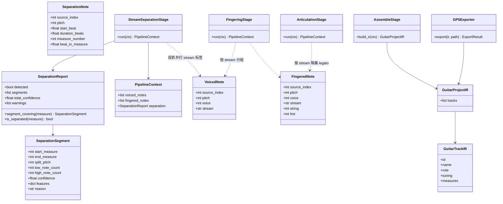
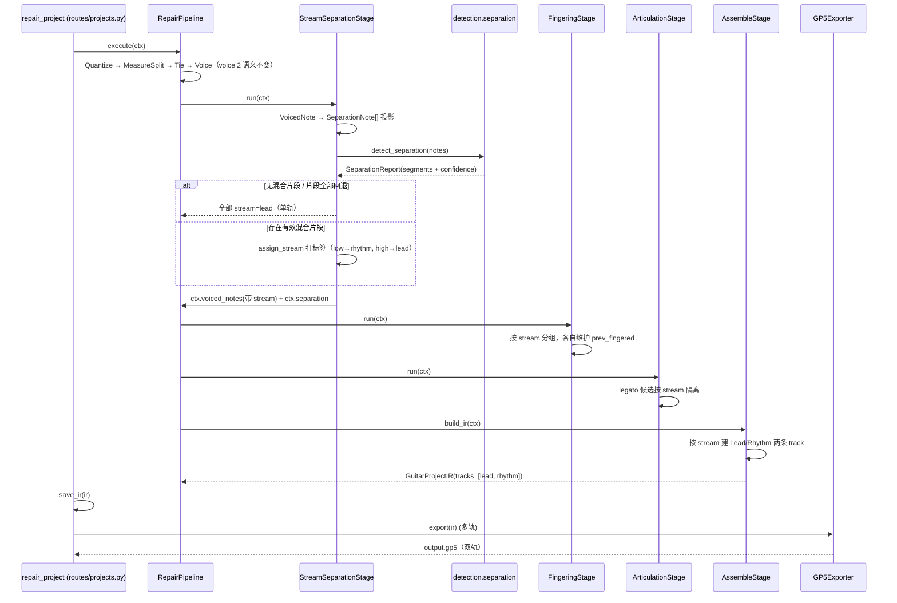

# FretPilot v2 — 低音 riff / 高音旋律分离 技术方案

> 文档类型：架构设计 + 任务分解
> 作者：高见远（Gao，Architect）
> 需求来源：许清楚（Xu，PM）《吉他 MIDI 声部分离 PRD（增量功能）》 + 主理人拍板的 9 条核心决策
> 状态：可进入实现

---

## 0. 一句话方案

在 `VoiceStage` 之后、`FingeringStage` 之前插入一个**纯确定性**的 `StreamSeparationStage`：用「音高直方图双峰 + 最大间隔分隔点 + 复音 onset 同窗 + 时值对比」四路信号，按**小节**检测「低音 riff + 高音旋律并存」的混合片段，给每个音符打 `stream ∈ {lead, rhythm}` 标签；下游 `FingeringStage`/`ArticulationStage` 改为**按 stream 分组**处理（保证指法连续性与 legato 不跨轨），`AssembleStage` 据此产出 **1 或 2 条 `GuitarTrackIR`**，GP5 exporter 支持多轨写出。**无混合片段或低置信度时整段/片段回退单轨，与现版本输出逐字节一致（回归无损）。**

关键点：**完全不碰 `VoiceStage` 与 voice 2 语义**——voice 2 永远 = 该轨「超范围音符」，声部分离发生在 **track 层**，两条机制正交共存。

---

## 1. 实现方案 + 框架选型

### 1.1 核心难点与选型

| 难点 | 结论 |
| --- | --- |
| 检测「低音 + 高音并存」 | 组合信号（双峰 + 复音 onset + 动态分隔点 + 时值），全部为确定性数值算法，**无 LLM、无新增第三方依赖**（满足 <2s 且不引入新框架） |
| 分离粒度 | 2 条独立 track（Lead/Rhythm），**不用单轨双 voice**——voice 2 已被超范围音符占用 |
| 拆分后指法正确性 | 拆分必须发生在 **fingering 之前**，且 fingering/articulation 按 stream 隔离，否则 Lead 旋律的按弦手型会被紧随其后的低音 riff 干扰 |
| 多轨导出 | pyguitarpro 原生支持多轨（`song.tracks` 为 list，`gp.Track(song, number=N, ...)` 构造新轨并自动对齐 `measureHeaders`，已验证可写出） |
| 回归无损 | 无分离场景走「全部 stream=lead」单轨路径，`AssembleStage`/导出器输出与现版本一致 |

### 1.2 Stage 位置（7 → 8 阶段）

```
Quantize → MeasureSplit → Tie → Voice → [StreamSeparation ★新增] → Fingering → Articulation → Assemble
```

- **为什么在 Voice 之后**：`VoicedNote` 已具备 pitch / 量化 onset / 原始时值 / 小节号 / tie 信息，检测与拆分所需字段齐备；ringing 归一已做完，`duration_beats` 干净。
- **为什么在 Fingering 之前**：fingering 的 `prev_fingered` 手型连续性与 articulation 的 legato 都必须**按轨独立**，拆分必须先于它们。
- **VoiceStage 零改动**：voice 2 = 超范围音符的语义保持不变（超范围音符在 `FingeringStage._unplayable_note` 里才被压到 voice 2）。

### 1.3 模块分层

- **纯算法层** `detection/separation.py`：只依赖标准库，可独立单测（输入 `SeparationNote[]` → 输出 `SeparationReport`）。不 import engine/ir，避免循环依赖。
- **管道适配层** `engine/stages/separation.py`：把 `VoicedNote` 投影为 `SeparationNote`，调用纯算法，回写 `stream` 标签与 `ctx.separation`。
- **下游改造** `fingering.py` / `articulation.py`：按 stream 分组，无分离时等价于现行为。

---

## 2. 文件列表及相对路径

### 2.1 新建文件

| 路径 | 职责 |
| --- | --- |
| `backend/src/fretpilot/detection/separation.py` | 分离检测/拆分纯算法 + 结果数据模型（`SeparationNote`/`SeparationSegment`/`SeparationReport`） |
| `backend/src/fretpilot/engine/stages/separation.py` | `StreamSeparationStage`（管道适配） |
| `backend/tests/test_separation.py` | 检测算法单测 + stage 单测 |

### 2.2 修改文件

| 路径 | 改动点 |
| --- | --- |
| `backend/src/fretpilot/detection/__init__.py` | 导出 `detect_separation` / `assign_stream` / `SeparationReport` 等 |
| `backend/src/fretpilot/engine/context.py` | `VoicedNote`/`FingeredNote` 加 `stream: str = "lead"`；`PipelineContext` 加 `separation: SeparationReport \| None = None` |
| `backend/src/fretpilot/engine/stages/__init__.py` | 注册 `StreamSeparationStage` |
| `backend/src/fretpilot/engine/pipeline.py` | 阶段列表插入分离 stage（7→8），更新 docstring |
| `backend/src/fretpilot/engine/stages/fingering.py` | 按 stream 分组、独立 `prev_fingered`，`FingeredNote` 携带 stream |
| `backend/src/fretpilot/engine/stages/articulation.py` | legato 候选按 stream 隔离 |
| `backend/src/fretpilot/engine/stages/assemble.py` | `build_ir` 按 stream 产出 1/2 条 track |
| `backend/src/fretpilot/exporters/gp5.py` | `_configure_song`/`export` 支持多轨（去掉 `len(tracks) != 1` 守卫） |
| `backend/src/fretpilot/exporters/ample_midi/renderer.py` | 去掉 `len(tracks) != 1` 守卫（合并渲染，回放保真） |
| `backend/src/fretpilot/api/routes/projects.py` | `RepairResponse` 增加可选 `separation` 摘要（轨数/角色/置信度） |
| `backend/tests/test_detection.py` / `test_pipeline_stages.py` / `test_multivoice.py` / `test_exporters.py` | 扩展用例 |
| `backend/tests/golden/test_golden.py` / `test_tokyo_midnight.py` | 回归 + 真实样本 + 性能预算 |
| `frontend/src/api/types.ts` | 增加 `SeparationInfo` 类型 |
| `frontend/src/hooks/useAlphaTab.ts` | 多轨时传 `trackIndexes: [0,1]` |
| `frontend/src/components/TabViewer.tsx` | 接收并透传多轨渲染参数 |
| `frontend/src/pages/WorkbenchPage.tsx` | 展示 Lead/Rhythm 轨角色与分离置信度 |

> 说明：IR schema（`ir/models.py`）**零改动**——`GuitarProjectIR.tracks` 已是 list、`GuitarTrackIR.role` 已预留 lead/rhythm；分离报告复用现有 `Transformation` + `warnings` 通道，无需 bump schema。

---

## 3. 数据结构和接口

### 3.1 检测结果数据结构（`detection/separation.py`）

```python
@dataclass(slots=True)
class SeparationNote:
    """检测阶段的轻量音符视图（从 VoicedNote 投影，不依赖 engine 层）。"""
    source_index: int
    pitch: int
    start_beat: float            # 量化 onset
    duration_beats: float        # 用 original_duration_beats（riff/旋律时值对比需原始时值）
    measure_number: int
    beat_in_measure: float


@dataclass(slots=True)
class SeparationSegment:
    """一个被判定为「低音 riff + 高音旋律并存」的连续片段。"""
    start_measure: int
    end_measure: int
    split_pitch: int             # 动态分隔点：pitch < split_pitch → rhythm
    low_note_count: int
    high_note_count: int
    confidence: float            # 0~1
    features: dict[str, float]   # {"gap": 0.8, "polyphony": 0.7, "duration_contrast": 0.6}
    reason: str


@dataclass(slots=True)
class SeparationReport:
    """整轨检测结果。"""
    detected: bool               # 是否存在 ≥1 个有效（未回退）混合片段
    segments: list[SeparationSegment] = field(default_factory=list)
    total_confidence: float = 0.0
    warnings: list[str] = field(default_factory=list)

    def segment_covering(self, measure_number: int) -> SeparationSegment | None: ...
    def is_separated(self, measure_number: int) -> bool: ...
    def split_pitch_for(self, measure_number: int) -> int | None: ...
```

### 3.2 核心纯函数接口

```python
# detection/separation.py
def detect_separation(
    notes: list[SeparationNote],
    *,
    low_prior: tuple[int, int] = (40, 55),   # E2..G3 低音弦区软先验，不写死分隔点
    min_side_notes: int = 3,
    min_coactive_onsets: int = 2,
    min_gap_semitones: int = 5,
    confidence_threshold: float = 0.5,       # 低于此值 → 片段级回退
) -> SeparationReport: ...

def assign_stream(
    note: SeparationNote,
    report: SeparationReport,
) -> str: ...   # "lead" | "rhythm"
```

### 3.3 PipelineContext 新增字段（`engine/context.py`）

```python
@dataclass
class PipelineContext:
    # ... 现有字段不变 ...
    separation: "SeparationReport | None" = None   # 新增：分离检测结果

# 中间音符类型：新增 stream 标签（默认 lead，保证无分离时行为不变）
@dataclass(slots=True)
class VoicedNote:
    # ... 现有字段 ...
    stream: str = "lead"           # 新增

@dataclass(slots=True)
class FingeredNote:
    # ... 现有字段 ...
    stream: str = "lead"           # 新增
```

### 3.4 AssembleStage 多轨产出改造

```python
def _build_measures(ctx, stream: str | None = None) -> list[GuitarMeasure]:
    # 按 ctx.measures 边界建全量小节；仅把 stream 匹配的 fingered_notes 填入。
    # stream=None 表示不过滤（等价于 stream=="lead"，因为单轨时全部是 lead）。

def _build_track(ctx, measures, *, role, name, track_id) -> GuitarTrackIR:
    # 抽出的 track 构造：tuning 来自 ctx.tuning（lead/rhythm 共用源吉他定弦）。

def build_ir(ctx) -> GuitarProjectIR:
    report = ctx.separation
    if report is None or not report.detected:
        # 单轨：与现版本逐字段一致（回归无损）
        tracks = [_build_track(ctx, _build_measures(ctx, "lead"),
                               role=ctx.track_role, name=ctx.track.name,
                               track_id=ctx.track_id)]
    else:
        lead = _build_track(ctx, _build_measures(ctx, "lead"),
                            role="lead", name=f"{ctx.track.name or 'Guitar'} - Lead",
                            track_id=ctx.track_id)
        rhythm = _build_track(ctx, _build_measures(ctx, "rhythm"),
                              role="rhythm", name=f"{ctx.track.name or 'Guitar'} - Rhythm",
                              track_id=f"{ctx.track_id}-rhythm")
        tracks = [lead, rhythm]              # 决策7：Lead 在前 Rhythm 在后
    return GuitarProjectIR(..., tracks=tracks, ...)
```

### 3.5 类图

见随附文件 `docs/stream-separation-class-diagram.mermaid`；内嵌如下：



---

## 4. 分离算法设计（核心）

### 4.1 检测阶段

**输入**：某轨全部 `VoicedNote`（投影为 `SeparationNote`）。
**检测粒度**：以**小节**为最小单元（对齐 IR 小节结构，契合用户「某些小节」描述），再把相邻混合小节合并为片段。

#### 步骤（伪代码）

```
function detect_separation(notes):
    by_measure = group_by(notes, measure_number)

    candidates = []
    for (mnum, mnotes) in by_measure:
        # ── 信号1：音高直方图双峰 + 动态分隔点 ──
        hist = weighted_pitch_histogram(mnotes)          # 按时值加权，3 半音三角核平滑
        (split, gap_score) = find_best_split(hist, low_prior, min_gap_semitones)
        if split is None: continue                       # 无双峰/无有效 gap

        low  = [n for n in mnotes if n.pitch < split]
        high = [n for n in mnotes if n.pitch >= split]
        if len(low) < min_side_notes or len(high) < min_side_notes: continue

        # ── 信号2：复音 onset 同窗（并发，而非先后交替）──
        poly_score = coactive_onset_ratio(low, high)     # 低/高同一 onset 并发占比
        if poly_score 不达标: continue                    # 剔除「先低后高」的宽音域旋律

        # ── 信号3：时值/连续性对比（辅助，调置信度不硬卡）──
        dur_score = duration_contrast(low, high)

        # ── 信号4：组合置信度 ──
        conf = clamp(0.40*gap_score + 0.35*poly_score + 0.25*dur_score, 0, 1)
        candidates.append(SeparationSegment(mnum, mnum, split, ...))

    # ── 合并相邻混合小节为片段，分隔点取合并区间重算（更稳）──
    segments = merge_adjacent(candidates, notes, max_gap_measures=1)

    # ── 片段级回退：低置信度片段不拆，只保留达标片段 ──
    active = [s for s in segments if s.confidence >= confidence_threshold]
    return SeparationReport(detected=bool(active), segments=active, ...)
```

#### 子算法细化

**A. `find_best_split`（动态分隔点，不写死音高）**

```
function find_best_split(hist, low_prior, min_gap):
    # 候选分隔点限制在低音弦区先验窗口 [E2..G3]（40..55），不硬编码具体音高
    best = None
    for s in range(low_prior[0], low_prior[1] + 1):
        low_peak  = max(hist[low_prior[0] : s])
        high_peak = max(hist[s : high_region_end])
        valley    = sum(hist[s - gap_half : s + gap_half])   # 分隔点邻域应近空
        peak_sep  = argmax(high_side_pitch) - argmax(low_side_pitch)   # 峰间距
        # gap 得分 = 谷深 / 峰值；惩罚峰距不足（< min_gap 半音）
        if peak_sep < min_gap: continue
        score = valley / max(low_peak + high_peak, eps) * (1 - min_gap / peak_sep)
        if score > best.score: best = (s, score)
    return best  # 无候选返回 None
```

> 更简单稳健的等价实现：对去重后的音高序列排序，找落在低音先验窗口内**最大的相邻音高间隔**，分隔点取该 gap 中点；两侧各需 ≥ `min_side_notes` 个音符。工程上推荐此实现（O(N log N)，无参数搜索）。

**B. `coactive_onset_ratio`（复音 onset 同窗）**

```
function coactive_onset_ratio(low, high):
    tol = 0.25   # 1/16 拍容差
    low_onsets = 去重(low.start_beat 按 tol 归并)
    coactive = 0
    for onset in low_onsets:
        if any(|h.start_beat - onset| <= tol for h in high):
            coactive += 1
    return coactive / len(low_onsets)   # 要求 >= 0.5 且 coactive >= min_coactive_onsets
```

> 意义：**并发**（低音 riff 与旋律同拍起奏）才算混合；同一小节「前半段低、后半段高」的宽音域旋律会被此信号剔除，避免误拆。

**C. `duration_contrast`（时值/连续性辅助）**

```
function duration_contrast(low, high):
    low_short  = fraction(low,  duration <= 0.5 beat)          # riff 短音占比
    low_rhythm = 1 - (std(low 的 onset 间隔) / mean(onset 间隔))  # 节奏重复规律性
    high_long  = mean(high.duration) 相对 low 的比值
    high_step  = mean(|Δpitch|) 相对 low 的比值                  # 旋律连续移动
    return clamp(0.35*low_short + 0.25*low_rhythm + 0.25*high_long + 0.15*high_step, 0, 1)
```

> 该信号仅作为置信度加分项（权重 0.25），不作为硬门槛——避免因时值形态不典型而漏拆。

**D. `merge_adjacent`（合并相邻片段）**

```
function merge_adjacent(candidates, notes, max_gap_measures):
    # 相邻小节，或间隔 <= max_gap_measures 个非混合小节，合并为一个片段
    # 合并后 split_pitch = median(各小节 split_pitch)（更稳，避免 riff 跨小节时分隔点抖动）
    # low/high 计数取合并区间并集
```

### 4.2 拆分阶段（音符归位：不丢、不重）

```
function assign_stream(note, report) -> str:
    seg = report.segment_covering(note.measure_number)
    if seg is None:
        return "lead"                          # 非混合段 → 保持单轨(lead)
    return "rhythm" if note.pitch < seg.split_pitch else "lead"
```

**正确性保证：**
1. **不丢不重**：每个音符恰好被分到 lead 或 rhythm 之一，两轨音符并集 = 原音符全集（纯 partition）。
2. **tie 片段同轨**：按 `source_index` 归位（同一物理音符的 pitch 恒定，跨小节 tie 片段自然落到同轨），避免一个延音音符被拆到两条轨。
3. **纯旋律/纯 riff 段保持单轨**：`segment_covering` 返回 None 时全部进 lead，不产生空轨。
4. **voice 语义不变**：拆分只改 stream，不改 voice；每轨内 voice 1 = 正常、voice 2 = 该轨超范围（由 fingering 阶段独立产生）。

### 4.3 置信度计算

```
segment.confidence = clamp(0.40*gap_score + 0.35*poly_score + 0.25*dur_score, 0, 1)
report.total_confidence = Σ(seg.confidence * seg_note_count) / Σ(seg_note_count)   # 按音符数加权
```

### 4.4 片段级回退逻辑

```
CONFIDENCE_THRESHOLD = 0.5    # 低于此值：该片段不拆，全部进 lead
LOW_CONF_WARNING    = 0.7     # 介于 [0.5, 0.7)：拆分但写入 warning 提示复核

for seg in segments:
    if seg.confidence < 0.5:
        # 片段级回退：该片段保持单轨，不产生 Rhythm 音符
        ctx.warnings.append(f"小节 {seg.start}-{seg.end} 低置信度({seg.conf:.2f})，保持单轨")
    elif seg.confidence < 0.7:
        ctx.warnings.append(f"小节 {seg.start}-{seg.end} 自动分离置信度较低({seg.conf:.2f})，建议复核")
```

> 决策 6 落地：**片段级回退**（只回退低置信度片段），而非整曲回退。纯确定性算法，2151 音符/140 小节的复杂度 O(N log N + S×40)，实测 < 10ms，满足 <2s 预算。

---

## 5. 程序调用流程



完整时序图见随附 `docs/stream-separation-sequence-diagram.mermaid`。

---

## 6. 依赖包列表

**无新增第三方依赖。** 全部为 Python 标准库 + 现有 `dataclasses` 实现；GP5 多轨复用现有 `pyguitarpro`（已安装）。

---

## 7. 任务列表（有序，含依赖）

| 任务 | 名称 | 优先级 | 依赖 | 关键文件 |
| --- | --- | --- | --- | --- |
| T01 | 分离契约 + 检测核心算法 | P0 | — | `detection/separation.py`(新)、`detection/__init__.py`、`engine/context.py`、`tests/test_separation.py` |
| T02 | 管道接入 + 流感知下游 | P0 | T01 | `engine/stages/separation.py`(新)、`engine/stages/__init__.py`、`engine/pipeline.py`、`engine/stages/fingering.py`、`engine/stages/articulation.py` |
| T03 | 多轨 IR 产出 + 多轨导出 | P0 | T01, T02 | `engine/stages/assemble.py`、`exporters/gp5.py`、`exporters/ample_midi/renderer.py`、`api/routes/projects.py`、`tests/test_exporters.py` |
| T04 | 前端展示 + API 响应（P1） | P1 | T03 | `frontend/src/api/types.ts`、`frontend/src/hooks/useAlphaTab.ts`、`frontend/src/components/TabViewer.tsx`、`frontend/src/pages/WorkbenchPage.tsx` |
| T05 | 回归 + 端到端验收 | P0 | T02, T03 | `tests/test_multivoice.py`、`tests/test_pipeline_stages.py`、`tests/golden/test_golden.py`、`tests/test_tokyo_midnight.py` |

### 各任务详细内容

#### T01 — 分离契约 + 检测核心算法（基础设施）
- 新建 `detection/separation.py`：`SeparationNote`/`SeparationSegment`/`SeparationReport` dataclass + `detect_separation`/`assign_stream` 纯函数（§4 全部算法）。
- `detection/__init__.py` 导出新符号。
- `engine/context.py`：`VoicedNote`/`FingeredNote` 加 `stream="lead"`；`PipelineContext` 加 `separation` 字段（import 自 `detection.separation`，避免循环依赖）。
- `tests/test_separation.py`：合成音符（双峰混合 / 先低后高 / 纯旋律 / 纯 riff）单测，断言 `detected`、`split_pitch`、`confidence`、回退行为。
- **验收**：纯函数可独立跑通；`pytest tests/test_separation.py` 全绿。

#### T02 — 管道接入 + 流感知下游
- 新建 `engine/stages/separation.py`：投影 `VoicedNote→SeparationNote`，调 `detect_separation`，用 `dataclasses.replace` 回写 `stream`；把片段写为 `Transformation`（stage=`stream_separation`）+ 低置信 warning。
- `engine/stages/__init__.py`、`engine/pipeline.py`：插入 stage（Voice 与 Fingering 之间）。
- `fingering.py`：按 `("lead","rhythm")` 顺序分组，各自 `prev_fingered=None` 独立连续；`_build_fingered_note` 携带 `stream=note.stream`。
- `articulation.py`：`_infer_legato_articulation` 的 `same_string` 过滤加 `n.stream == note.stream`。
- **验收**：单轨（无分离）时输出与改动前逐字节一致（回归无损）。

#### T03 — 多轨 IR 产出 + 多轨导出
- `assemble.py`：抽 `_build_measures(ctx, stream)` / `_build_track(ctx, measures, *, role, name, track_id)`；`build_ir` 按 §3.4 产 1/2 轨。
- `exporters/gp5.py`：`_configure_song` 去掉单轨守卫，`song.measureHeaders` 建一次；对每条 `GuitarTrackIR` 建 GP track（首轨用 `song.tracks[0]`，后续用 `gp.Track(song, number=N, name=..., fretCount=..., strings=[...])` 并 append，构造时自动对齐 measureHeaders）；`export` 循环逐轨 `_populate_voice`，`note_lookup`/`_apply_linked_effects` 按轨隔离。
- `exporters/ample_midi/renderer.py`：去掉 `len != 1` 守卫（合并渲染，回放保真），加 warning 说明。
- `api/routes/projects.py`：`RepairResponse` 增 `separation: SeparationInfo | None`（`track_count`/`roles`/`segments`/`total_confidence`），由 `ir.tracks` + `ir.changes` 推导。
- `tests/test_exporters.py`：构造 2 轨 IR → gp5 可写、可读回、双轨存在；ample 不崩。
- **验收**：真实样本导出 gp5 双轨，Guitar Pro 可打开、可分别静音/编辑。

#### T04 — 前端展示 + API 响应（P1）
- `api/types.ts`：加 `SeparationInfo`/`SeparationSegment` 类型。
- `useAlphaTab.ts`：多轨时 `api.load(data, trackIndexes)`；`TabViewer.tsx` 透传。
- `WorkbenchPage.tsx`：展示 Lead/Rhythm 轨角色 + 分离置信度（低置信高亮提示复核）。
- **验收**：分离结果在谱面区分两条轨，无分离时与现版 UI 一致。

#### T05 — 回归 + 端到端验收
- `test_multivoice.py`：验证 voice 2（超范围）与 track 分离正交共存。
- `test_pipeline_stages.py`：端到端（合成混合 MIDI → execute → 断言 IR 有 2 轨 + 音符并集 = 原集）。
- `test_tokyo_midnight.py` + `golden/test_golden.py`：真实样本 `tests/fixtures/tokyo_midnight.mid` 回归；**性能基准**（检测+分离 <2s）；无分离样本回归无损。
- **验收**：`pytest` 全绿，golden 快照更新并人工复核拆分离正确率 ≥95%。

---

## 8. 共享知识（跨文件约定）

1. **多轨 IR 字段约定**：
   - 单轨（未分离）：`tracks=[track]`，`role=ctx.track_role`，`name=ctx.track.name`，`id=ctx.track_id`（与现版本一致）。
   - 双轨：`Lead`(role=`lead`, id=`ctx.track_id`, name=`{原轨名} - Lead`) 在前；`Rhythm`(role=`rhythm`, id=`{ctx.track_id}-rhythm`, name=`{原轨名} - Rhythm`) 在后。
   - 两轨 `source_track_index` 均 = `ctx.source_track_index`（同源轨）；`tuning` 相同（源吉他定弦）。
2. **stream 标签**：`"lead"`（高音旋律/非混合段所有音符）、`"rhythm"`（混合片段中的低音 riff）。默认值 `"lead"`，保证无分离路径零改动。
3. **voice 语义不变**：`VoiceStage` 不改；`voice 1 = 正常`、`voice 2 = 该轨超范围音符`。分离只发生在 track 层。
4. **不丢不重**：拆分是音符集的纯 partition；按 `source_index` 归位保证 tie 片段同轨。
5. **分离报告通道**：复用 IR `Transformation`（`stage="stream_separation"`，每个片段一条，`source_note_index` 取该片段首个低音音符）+ `warnings`（低置信提示）。**不改 IR schema**。
6. **回归无损**：任何「未分离」分支的输出必须与现版本逐字段一致；新增字段带默认值，序列化/反序列化（serde）无需改动。
7. **检测输入用原始时值**：`duration_beats` 特征取 `original_duration_beats`（riff/旋律对比需未被 ringing 截断的时值）。
8. **GP5 多轨**：所有 track 共享同一组 `measureHeaders`；Rhythm 轨空小节写休止（GP5 exporter 已支持 `_make_rest_beats`）。
9. **性能**：检测+分离纯确定性、无 LLM；`<2s` 预算，实测应为毫秒级。

---

## 9. 待明确事项（Assumptions）

1. **低音 riff 音域先验**：采用软先验窗口 E2–G3（MIDI 40–55），**不写死分隔点**。若 Steven 样本低音 riff 实际超出该窗口，需在 T01 校准 `low_prior` 常量（当前为假设）。
2. **角色归属**：极低 riff（接近贝斯音域）仍标 `rhythm`（决策 5 已定：源轨是吉他）；是否「低于某音高 → bass」本迭代不引入。
3. **轨命名后缀**：采用 `{原轨名} - Lead / - Rhythm`（保留原轨名 + 后缀）。若用户更倾向 `Lead Guitar`/`Rhythm Guitar`，改 `assemble.py` 一处即可。
4. **检测粒度**：按小节检测 + 跨小节合并（`max_gap_measures=1`）。允许跨小节边界的 riff 短语被合并为同一片段。
5. **Ample MIDI 多轨**：P0 只做「去守卫 + 合并渲染（回放保真）」；双轨独立 Ample MIDI 通道视为 P2，不阻塞本次迭代。
6. **分离报告持久化**：复用 `Transformation`+`warnings`（不改 schema）。若后续需要结构化查询（如「列出所有分离小节」），可升级为 IR 顶层新字段 `separation_report`，需 bump schema。
7. **前端 P1 范围**：谱面区分两条轨 + 角色标注 + 低置信高亮；「对比视图/单轨回放」为 P2。

---

## 附：关键实现提醒（供工程师）

- **避免循环依赖**：`detection/separation.py` 只 import 标准库；`context.py` → import `detection.separation`（单向）。
- **`VoicedNote` 为 `@dataclass(slots=True)`（可变）**：回写 stream 建议用 `dataclasses.replace`（与 VoiceStage 一致），不要就地改字段。
- **FingeringStage 回归陷阱**：改分组后，单轨（全部 stream=lead）的 `prev_fingered` 连续性必须与现版本完全一致（rhythm 组为空，边界 reset 无副作用）。
- **GP5 多轨构造**（已验证）：`gp.Track(song, number=N, name=..., fretCount=..., strings=[...])` 构造后 `song.tracks.append(...)`，`measures` 会自动对齐 `song.measureHeaders`；首轨沿用 `song.tracks[0]` 不改构造方式。
- **`note_lookup` 按轨隔离**：hammer_on/pull_off 的 `source_note_id` 仅在同轨内解析，避免跨轨误连。
